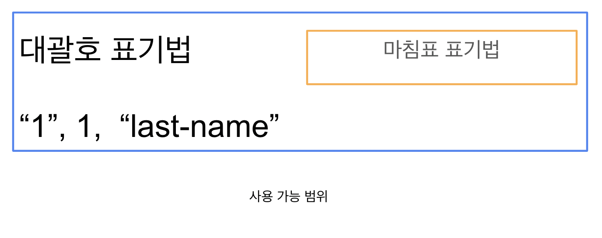

# 010. 객체 리터럴

## 10.1 객체란?

자바스크립트는 객체 기반의 프로그래밍 언어이며, 자바스크립트를 구성하는 거의 "모든 것"이 객체다. 원시 값을 제외한 나머지 값(함수, 배열, 정규 표현식 등)은 모두 객체다.

원시 타입 값(원시값): 변경 불가능한 값(immutable value)

객체 타입의 값 (객체): 변경 가능한 값(mutable value) (함수, 배열, 정규 표현식 등 원시 값 제외 나머지)

객체: 프로퍼티로 이루어짐.  프로퍼티는 키와 값으로 구성.

- 프로퍼티 : 객체의 상태를 나타내는 값 (data)
- 메서드: 프로퍼티를 참조하고 조작할 수 있는 동작 (behavior)
(프로퍼티값이 함수일 경우, 일반함수와 구분하기 위해 메서드라고 부름)

## 10.2 객체 리터럴에 의한 객체 생성

c,자바 언어: 클래스 기반 객체지향 언어

자바스크립트: 프로토타입 기반 객체지향 언어

차이점 : 클래스 기반 객체지향 언어와는 달리 다양한 객체 생성 방법을 지원

- 객체 리터럴
- Object 생성자 함수
- 생성자 함수
- Object.create 메서드
- 클래스(ES6)

객체 리터럴 : =값으로 평가되는 표현식 ≠ 코드블록

닫는 중괄호 뒤에 세미콜론(;)을 붙임

## 10.3 프로퍼티

객체: 프로퍼티의 집합이며, 프로퍼티는 키와 값으로 구성

```jsx
var person = {
  // 프로퍼티 키는 name, 프로퍼티 값은 'Lee'
  name: 'Lee',
  // 프로퍼티 키는 age, 프로퍼티 값은 20
  age: 20
};
```

- 프로퍼티 나열할 때 쉼표(,)로 구분
- 프로퍼티 키: 빈 문자열을 포함하는 모든 문자열 또는 심벌 값(이외의 값을 사용하면 암묵적 타입변환을 통해 문자열됨)
- 프로퍼티 값: 자바스크립트에서 사용할 수 있는 모든 값
- 식별자 네이밍 규칙을 따르지 않는 이름은 따옴표 사용

```jsx
**에러 상황

var person = {
  firstName: 'Ung-mo',
  last-name: 'Lee' // SyntaxError: Unexpected token -
}; //last-name을 -연산자가 있는 표현식으로 해석

**따옴표 사용

var person = {
  firstName: 'Ung-mo', // 식별자 네이밍 규칙을 준수하는 프로퍼티 키
  'last-name': 'Lee' // 식별자 네이밍 규칙을 준수하지 않는 프로퍼티 키
};

console.log(person); // {firstName: 'Ung-mo', last-name: 'Lee'}
```

표현식을 사용해 프로퍼티 키를 동적으로 생성 가능

```jsx
상황: 빈 객체에 {hello: "world"}를 만들고 싶다면?!

var obj = {}; // 1. 객체 생성
var key = 'hello'; // 2. 키 네이밍

obj[key] = 'world'; // 3. 키에 값 부여
console.log(obj); //{hello:"world"}

1.객체 생성 var object = {};
2.키 네이밍 var key = '키네임';
3.값 부여 var obj[key] = 'value';

object = {키네임 : "value"};

```

중복선언하면 덮어씀

```jsx
var foo = {
name : "Lee",
name : "Kim"
};

console.log(foo); // {name: "Kim"}
```

## 10.4 메서드

- 객체에 묶여있는 함수

## 10.5 프로퍼티 접근

- 마침표 표기법
- 대괄호 표기법
    - 프로퍼티 키를 반드시 따옴표로 감싸야함.
    감싸지 않은 이름을 엔진이 식별자로 해석함
    //name is not defined 에러 발생

```jsx
2가지 에러
1- 대괄호 표기법에서 따옴표로 감싸지 않았을 경우
엔진은 이를 식별자로 해석하고 레퍼런스에러를 발생함
(단!! 숫자는 따옴표 생략 가능)

var person = {
	name: 'Lee'
};

console.log(person[name]);
//ReferenceError: name is not defined

2- 객체에 존재하지 않는 프로퍼티에 접근하는 경우

var person = {
	name: 'Lee'
};

console.log(person.age); //undefined
```



**대괄호 프로퍼티 접근 연산자 내부에 지정하는 프로퍼티 키는 반드시 따옴표로 감싼 문자열**이어야 한다. 대괄호 프로퍼티 접근 연산자 내에 따옴표로 감싸지 않은 이름을 프로퍼티 키로 사용하면 자바스크립트 엔진은 식별자로 해석한다.

**객체에 존재하지 않는 프로퍼티에 접근하면 undefined를 반환한다.** 이때 ReferenceError가 발생하지 않는 데 주의하자.

프로퍼티 키가 식별자 네이밍 규칙을 준수하지 않는 이름, 즉 자바스크립트에서 사용 가능한 유효한 이름이 아니면 반드시 대괄호 표기법을 사용해야 한다. 단, 프로퍼티 키가 숫자로 이뤄진 문자열인 경우 따옴표를 생략할 수 있다. 그 외의 경우 대괄호 내에 들어가는 프로퍼티 키는 반드시 따옴표로 감싼 문자열이어야 한다는 점을 잊지 말자.

---

## 10.6 프로퍼티 값 갱신 : 이미 존재하는 프로퍼티에 값을 할당

```jsx
var person = {
  name: 'Lee'
};

// person 객체에 name 프로퍼티가 존재하므로 name 프로퍼티의 값이 갱신된다.
person.name = 'Kim';

console.log(person); // {name: "Kim"}
```

---

## 10.7 프로퍼티 동적 생성 : 존재하지 않는 프로퍼티에 값을 할당

```jsx
var person ={
  name: 'Lee'
};

// person 객체에는 age 프로퍼티가 존재하지 않는다.
// 따라서 person 객체에 age 프로퍼티가 동적으로 생성되고 값이 할당된다.
person.age = 20;

console.log(person); // {name: "Lee", age: 20}
```

## 10.8 프로퍼티 삭제

```jsx
var person = {
	name: "Lee",
	age: "20"
};

delete person.age; // person {name : "Lee"}
delete person.address; // 존재하지 않는 프로퍼티를 삭제해도 에러가 발생하지 않음

```

## 10.9 프로퍼티 축약 표현

```jsx
let x = 1, y = 2;
//축약 표현
const obj = {x, y};
console.log(obj); ///{x:1, y:2}

let 변수1 = 값1;...
let 변수2 = 값2;...

{변수:값, 변수:값}인 객체를 만들고 싶다면

const obj = {변수1, 변수2};
console.log(obj); //{변수1: 값1 , 변수2: 값2}

```